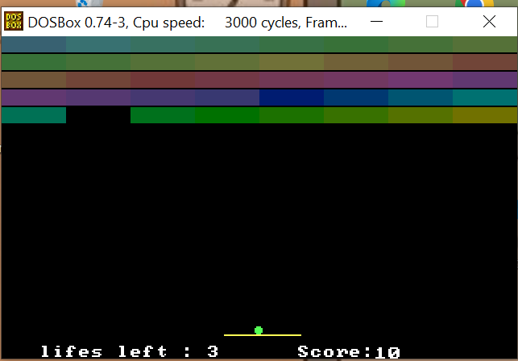

# Atari Breakout - Assembly Edition 🕹️



A fully functional Atari Breakout clone written entirely in **x86 Assembly Language**. This project explores direct video memory manipulation and keyboard interrupts to create a real-time gaming experience.

## 🚀 Key Features
* **Direct Graphics**: Uses VGA Mode 13h (320x200) for rendering bricks, paddles, and the ball.
* **Real-time Scoring**: Custom procedure to convert numeric scores into displayable string characters.
* **Physics Engine**: Implemented collision detection for walls, the paddle, and individual bricks.
* **Game Management**: Multi-life system (3 lives) and progressive speed difficulty.

## 🎮 Controls
* **Arrow Keys**: Move Paddle Left/Right.
* **F / S**: Increase or Decrease speed.
* **Space**: Reset game.
* **Down Arrow**: Activate "Fastest Ball" mode.

## 🛠️ How to Run
1. Install **DOSBox**.
2. Install the **NASM** assembler.
3. Assemble the code:
   ```bash
   nasm -f bin atarigame.asm -o atarigame.com
   ```
4. Run in DOSBox:
   ```bash
   atarigame.com
   ```
## 👨‍💻 Authors
**Abeer & Wania (FAST University)**
